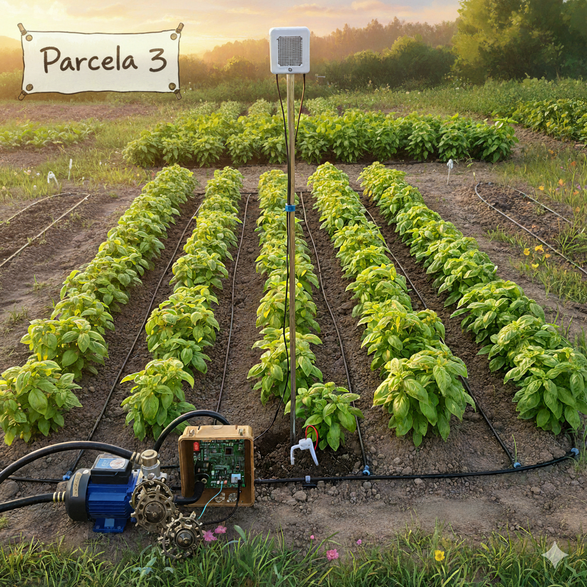

# 🌱 Sistema de Riego Automático – Interfaz Web

Este módulo corresponde a la **interfaz web** del sistema de riego automático con ESP32.  
Su propósito es **facilitar la visualización y el control** del sistema desde un navegador web.  

Con esta aplicación es posible:  
- Visualizar en tiempo real los parámetros de cada terreno:  
  - 🌡️ Temperatura  
  - 💧 Humedad ambiente  
  - 🌱 Humedad del suelo  
  - 📊 Volumen acumulado  
- Encender y apagar manualmente las bombas de riego.  
- Observar de forma instantánea los cambios gracias al uso de **MQTT + WebSockets**.  

La comunicación se realiza de la siguiente forma:  
- **ESP32** publica datos mediante **MQTT** en el broker público `test.mosquitto.org`.  
- **Flask (Python)** recibe los datos, los procesa y los envía al frontend por **WebSockets**.  
- **HTML/JS (Frontend)** actualiza la interfaz en tiempo real.  
- Cuando el usuario interactúa con la aplicación (ej. presionar el botón de bomba), la acción se envía de vuelta al **ESP32** mediante MQTT.  

---

## 📂 1. Estructura del módulo

El sistema está organizado en los siguientes archivos y carpetas:  

- `app.py` → Servidor Flask con integración de **SocketIO** y **MQTT**  
- `templates/index.html` → Interfaz web (frontend con HTML, CSS y JS)  
- `static/img/` → Imágenes de referencia de cada terreno (`PARCELA1.png`, `PARCELA2.png`, `PARCELA3.png`)  
- `README.md` → Este documento con toda la guía de instalación y uso  

---

## 🚀 2. Instalación y ejecución

### 2.1 Clonar el repositorio
```bash
git clone git@github.com:sebastianVP/SISTEMA_IRRIGACION_AUTOMAICA.git
cd SISTEMA_IRRIGACION_AUTOMAICA
```

### 2.2 Requisitos previos

Antes de ejecutar el proyecto asegúrate de contar con lo siguiente:  

- Python **3.9 o superior**  
- **pip** (gestor de paquetes de Python)  
- Conexión a internet (para utilizar el broker público `test.mosquitto.org`)  

---

### 2.3 Crear entorno virtual (opcional pero recomendado)

Es recomendable trabajar dentro de un entorno virtual para evitar conflictos con otras librerías de Python:  

```bash
python -m venv venv
source venv/bin/activate   # En Linux/Mac
venv\Scripts\activate      # En Windows
```

---

### 2.4 Instalar dependencias

#### 🔹 Opción 1: Instalar dependencias una por una

Instala los paquetes necesarios para el funcionamiento del servidor Flask y la comunicación con MQTT:  


```bash
pip install flask flask-socketio paho-mqtt eventlet
```
#### 🔹 Opción 2: Instalar todas desde requirements.txt
```bash
pip install -r requirements.txt
```

---

### 2.5 Ejecutar el servidor web

Corre la aplicación con el siguiente comando:  

```bash
python app.py
```

---

### 2.6 Acceso desde el navegador

Una vez iniciado, abre en tu navegador:  

- 👉 [http://127.0.0.1:5000](http://127.0.0.1:5000) (desde la misma computadora)  
- 👉 `http://192.168.x.x:5000` (desde otro dispositivo en tu red local, reemplazando `x.x` por la IP mostrada en la consola)  

---

## 🌐 3. Uso de la aplicación

La aplicación muestra **3 tarjetas**, una por cada terreno.  

Cada tarjeta incluye:  
- 🌡️ **Temperatura**  
- 💧 **Humedad ambiente**  
- 🌱 **Humedad del suelo**  
- 📊 **Volumen acumulado**  
- Indicador de estado de bomba (**verde = ON**, **rojo = OFF**)  

Además:  
- Cada terreno tiene un botón para **encender/apagar manualmente la bomba**  
- Los datos se actualizan automáticamente en la interfaz gracias a la integración con MQTT y WebSockets  

---

## 🔄 4. Flujo de comunicación

El ciclo de comunicación entre los componentes es el siguiente:  

1. **ESP32** mide sensores de humedad y temperatura → publica en los tópicos `riego/estado/x`  
2. **Broker MQTT** público (`test.mosquitto.org`) recibe los mensajes  
3. **Servidor Flask (`app.py`)** escucha estos tópicos y envía los datos al navegador mediante **WebSockets**  
4. **Frontend (`index.html`)** recibe los datos y actualiza la interfaz en tiempo real  
5. Cuando el usuario presiona un botón, **Flask publica en `riego/control/x`** → el **ESP32** recibe la orden y enciende/apaga la bomba correspondiente  

---

## ⚠️ 5. Notas importantes

- Actualmente se usa un **broker MQTT público** (`test.mosquitto.org`):  
  - ✅ Ventaja: fácil de usar para pruebas y simulaciones  
  - ⚠️ Desventaja: **No es seguro para producción para la simulacion es funcional** (cualquiera puede leer o enviar mensajes)  

**Recomendación:** Instalar un broker privado (ejemplo: **Mosquitto**) en un servidor o Raspberry Pi, configurando autenticación con usuario y contraseña.  

### 5.1 Tópicos usados

**Estado de los terrenos:**  
- `riego/estado/1`  
- `riego/estado/2`  
- `riego/estado/3`  

**Control de las bombas:**  
- `riego/control/1`  
- `riego/control/2`  
- `riego/control/3`  

---

## 📸 6. Interfaz

Ejemplo de tarjeta visual para un terreno en la aplicación web:  

  
  
  

---

## 📈 7. Mejoras futuras

- Guardar histórico de datos en una base de datos (ejemplo: **SQLite** o **InfluxDB**)  
- Incorporar gráficas en tiempo real utilizando **Chart.js** o **Plotly**  
- Añadir autenticación de usuarios en la aplicación web para mayor seguridad  
- Migrar a un broker MQTT privado con soporte **TLS** y credenciales de acceso  

---

## ✍️ 8. Autor

**Alexander Valdez**  
📅 Proyecto de tesis – *Sistema de Irrigación Automático para Plantío de Albahaca en la Zona Ica*  
👨‍💻 Implementación de firmware ESP32, servidor Flask y simulación  
